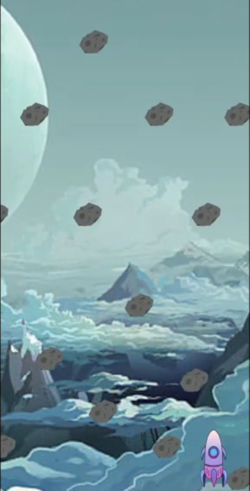
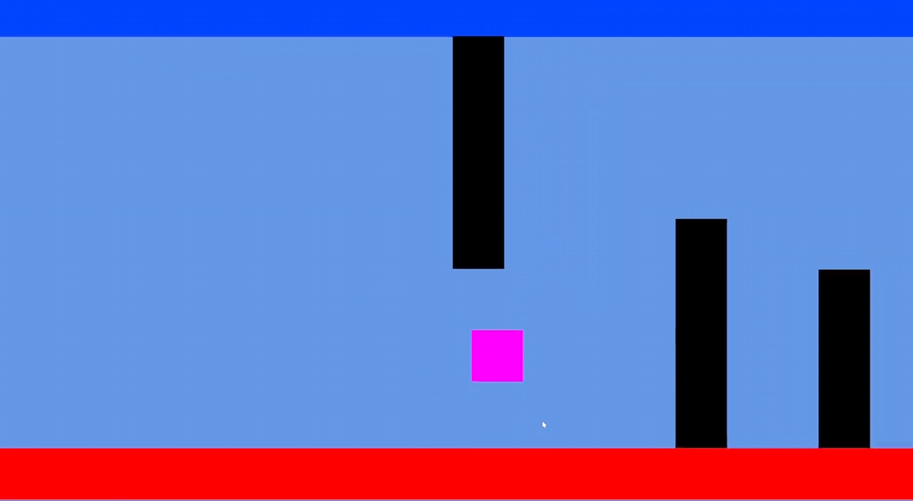

<!-- Improved compatibility of back to top link: See: https://github.com/othneildrew/Best-README-Template/pull/73 -->

<!--
*** Thanks for checking out the Best-README-Template. If you have a suggestion
*** that would make this better, please fork the repo and create a pull request
*** or simply open an issue with the tag "enhancement".
*** Don't forget to give the project a star!
*** Thanks again! Now go create something AMAZING! :D
-->

<!-- PROJECT SHIELDS -->
<!--
*** I'm using markdown "reference style" links for readability.
*** Reference links are enclosed in brackets [ ] instead of parentheses ( ).
*** See the bottom of this document for the declaration of the reference variables
*** for contributors-url, forks-url, etc. This is an optional, concise syntax you may use.
*** https://www.markdownguide.org/basic-syntax/#reference-style-links
-->

    

<!-- PROJECT LOGO -->
 

  <h3 align="center">Adaptive</h3>
  

  Adaptive is a 2D game built for the mobile platform inspired by flappy bird built in Unity.
     
    

    <a href="https://www.youtube.com/watch?v=_Tr9U8EX-OM" target="_blank">Trailer</a>
    

  

<!-- TABLE OF CONTENTS -->

  
Table of Contents

  <ol>
    <li>
      <a href="#about-the-project">About The Project</a>
      <ul>
        <li><a href="#built-with">Built With</a></li>
      </ul>
    </li>
    <li>
      <ul>
        <li><a href="#prerequisites">Prerequisites</a></li>
        <li><a href="#installation">Installation</a></li>
      </ul>
    </li>
    <li><a href="#contact">Contact</a></li>
  </ol>

<!-- ABOUT THE PROJECT -->
## About The Project

This is a touch based prototype game with the premise to test players based on their failure. The player begins the game at the hardest level, upon failure, the player is spawned into an easier level each time. This game was built as a prototype to test the viability of a reverse game progression and it's effect on player experience. The game started as a horizontal scroller, which was then changed to a vertical scroller since it allowed better use of the vertically taller phone screens. The player was also awarded two attempts at each level before being demoted as player testing revealed that players were likely to feel frustrated and not improve adapt to each level due to the speed of the game.

## Snapshots

Below are some screenshots of the game:

### Built With

Major frameworks/libraries used to bootstrap the project.

* Unity 2021.3.16f1

### Prerequisites

* Android
* Unity 2021+

### Installation

1. Clone the repo
2. Open Project in Unity
3. Play the Project inside Unity or Make a Build
4. Build apk and transfer it to your mobile device
5. Open app on mobile device
6. Enjoy!

<!-- CONTACT -->
## Contact

* Siddharth Singhai - sidsinghai97@gmail.com
* [![LinkedIn][linkedin-shield]][linkedin-url]
* [![Portfolio][portfolioIcon-url]][portfolio-url]

<!-- MARKDOWN LINKS & IMAGES -->
<!-- https://www.markdownguide.org/basic-syntax/#reference-style-links -->
[linkedin-shield]: https://img.shields.io/badge/-LinkedIn-black.svg?style=for-the-badge&logo=linkedin&colorB=555
[linkedin-url]: https://www.linkedin.com/in/abhinav-chitty-16a341152/
[linkedin-url]: https://www.linkedin.com/in/siddharthsinghai97/
[portfolio-url]: https://sidsinghai97.wixsite.com/portfolio
